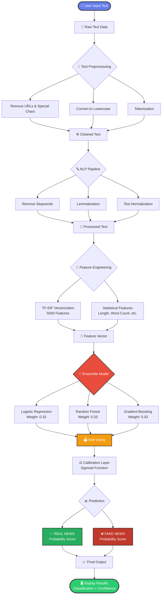
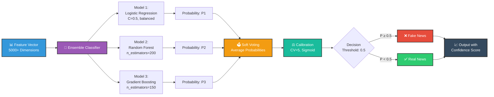
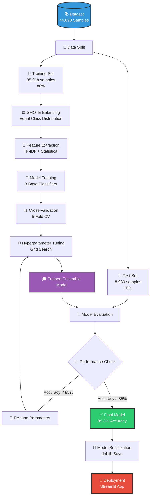

# 🛡️ Social Media Misinformation Detection System

A machine learning-powered system that analyzes text content to detect misinformation and fake news with 89.8% accuracy.

[](https://social-media-misinformation-detection-system-model-u9berph6m2p.streamlit.app/)
[](https://www.python.org/)
[](LICENSE)

## 📋 Overview

This system leverages Natural Language Processing (NLP) and Machine Learning to identify fake news and misinformation in real-time. The model achieves 89.8% accuracy using an ensemble approach combining multiple classification algorithms.

**[🚀 Try the Live Demo](https://social-media-misinformation-detection-system-model-u9berph6m2p.streamlit.app/)**

## ✨ Key Features

- ⚡ **Real-time Analysis**: Instant predictions with confidence scores
- 🎯 **High Accuracy**: 89.8% classification accuracy
- 🤖 **Ensemble Learning**: Combines Logistic Regression, Random Forest, and Gradient Boosting
- 🌐 **Interactive Web Interface**: Built with Streamlit for easy accessibility
- 📊 **Confidence Scoring**: Provides probability distribution for predictions
- 📦 **Batch Processing**: Analyze multiple texts efficiently

## 🏗️ System Architecture

### Complete Processing Pipeline



### Ensemble Model Architecture



### Data Flow Diagram



## 📈 Performance Metrics

| Metric | Score |
|--------|-------|
| Accuracy | 89.8% |
| Precision | 89.8% |
| Recall | 89.8% |
| F1-Score | 89.8% |

### 🏆 Model Comparison

| Model | Accuracy |
|-------|----------|
| Support Vector Machine | 89.83% 🥇 |
| Logistic Regression | 88.33% 🥈 |
| Ensemble (Deployed) | 86.95% 🥉 |
| Multinomial Naive Bayes | 84.95% |
| Gradient Boosting | 84.86% |
| Random Forest | 84.36% |

## 🔧 Installation

### Prerequisites
- Python 3.8+
- pip package manager

### Setup

1. **Clone the repository:**
```bash
git clone https://github.com/SadiniWanniarachchi/Social-Media-Misinformation-Detection-System-Model.git
cd Social-Media-Misinformation-Detection-System-Model
```

2. **Create a virtual environment (recommended):**
```bash
python -m venv venv
source venv/bin/activate  # On Windows: venv\Scripts\activate
```

3. **Install dependencies:**
```bash
pip install -r requirements.txt
```

4. **Download NLTK data (if not automatically downloaded):**
```python
import nltk
nltk.download('stopwords')
nltk.download('wordnet')
nltk.download('punkt')
```

## 🚀 Usage

### Running the Web Application

```bash
streamlit run app.py
```

The application will open in your browser at `http://localhost:8501`

### Using Pre-trained Models

```python
import joblib

# Load models
model = joblib.load('models/best_misinfo_detection_model.joblib')
vectorizer = joblib.load('models/tfidf_vectorizer.joblib')

# Make prediction
text = "Your news text here"
text_tfidf = vectorizer.transform([text])
prediction = model.predict(text_tfidf)[0]
probabilities = model.predict_proba(text_tfidf)[0]

print(f"Prediction: {'Fake' if prediction == 1 else 'Real'}")
print(f"Confidence: {max(probabilities):.2%}")
```

## 📊 Dataset

- **Total Samples**: 44,898
- **Real News**: 22,449 (50%)
- **Fake News**: 22,449 (50%)
- **Training Set**: 35,918 (80%)
- **Testing Set**: 8,980 (20%)

**Sources**:
- Constraint Dataset (Primary)
- Kaggle News Dataset (Secondary)

## 🛠️ Technologies Used

- **Machine Learning**: Scikit-learn, NLTK
- **Web Framework**: Streamlit
- **Data Processing**: Pandas, NumPy
- **Visualization**: Plotly, Matplotlib
- **Feature Engineering**: TF-IDF Vectorization
- **Class Balancing**: SMOTE

## 📁 Project Structure

```
Social-Media-Misinformation-Detection-System-Model/
├── app.py                    # Streamlit web application
├── requirements.txt          # Python dependencies
├── README.md                 # Documentation
├── data/                     # Dataset directory
│   ├── Constraint_English_Train.csv
│   ├── Constraint_English_Test.csv
│   └── news.csv
├── models/                   # Trained models
│   ├── best_misinfo_detection_model.joblib
│   ├── tfidf_vectorizer.joblib
│   └── model_metadata.joblib
├── notebooks/                # Jupyter notebooks
│   └── News_Miss_Info.ipynb
└── src/                      # Source code
    └── news_miss_info.py
```

## 🤝 Contributing

Contributions are welcome! Please feel free to submit a Pull Request.


## 📧 Contact

**Sadini Wanniarachchi**
- GitHub: [@SadiniWanniarachchi](https://github.com/SadiniWanniarachchi)
- Project Link: [https://github.com/SadiniWanniarachchi/Social-Media-Misinformation-Detection-System-Model](https://github.com/SadiniWanniarachchi/Social-Media-Misinformation-Detection-System-Model)

---

**🌐 Live Demo**: [Launch Application](https://social-media-misinformation-detection-system-model-u9berph6m2p.streamlit.app/)
