<div align="center">

# �️ Social Media Misinformation Detection System

### *Fighting Fake News with AI - One Prediction at a Time*


[](https://www.python.org/)
[](https://streamlit.io/)
[](https://scikit-learn.org/)
[](https://github.com/SadiniWanniarachchi/Social-Media-Misinformation-Detection-System-Model)
[](LICENSE)

<p align="center">
  <a href="#-try-it-live">Live Demo</a> •
  <a href="#-features">Features</a> •
  <a href="#-installation">Installation</a> •
  <a href="#-model-performance">Performance</a> •
  <a href="#-documentation">Docs</a> •
  <a href="#-contact">Contact</a>
</p>

---

### 🚀 **TRY IT LIVE!**

<a href="https://social-media-misinformation-detection-system-model-u9berph6m2p.streamlit.app/">
  
</a>

**Experience real-time misinformation detection powered by AI**  
*No installation required • Works in your browser • Instant results*

---

</div>

> **🎯 Mission**: Leveraging cutting-edge Machine Learning and Natural Language Processing to combat the spread of fake news and misinformation across social media platforms.

<div align="center">

**Built with ❤️ by [Sadini Wanniarachchi](https://github.com/SadiniWanniarachchi)**

[](https://github.com/SadiniWanniarachchi)
[](https://github.com/SadiniWanniarachchi/Social-Media-Misinformation-Detection-System-Model)

</div>

---

<br>

## � Table of Contents

<details>
<summary>Click to expand</summary>

- [🎯 Overview](#-overview)
- [✨ Features](#-features)
- [🎥 Demo](#-demo)
- [🏗️ Architecture](#️-architecture)
- [🔧 Installation](#-installation)
- [🚀 Usage](#-usage)
- [📈 Model Performance](#-model-performance)
- [📊 Dataset](#-dataset)
- [📁 Project Structure](#-project-structure)
- [🛠️ Technologies Used](#️-technologies-used)
- [🔬 How It Works](#-how-it-works)
- [📊 Results & Visualizations](#-results--visualizations)
- [🔌 API Reference](#-api-reference)
- [🤝 Contributing](#-contributing)
- [🚀 Future Enhancements](#-future-enhancements)
- [📝 License](#-license)
- [📧 Contact](#-contact)

</details>

---

<br>

## 🎯 Overview

<div align="center">

### *Transforming the Fight Against Misinformation*

</div>

The **Social Media Misinformation Detection System** is a cutting-edge AI application that analyzes text content to determine authenticity with remarkable **89.8% accuracy**. In an era where misinformation spreads faster than ever, this system serves as a powerful tool to verify news credibility and protect users from fake content.

<table>
<tr>
<td width="50%">

### 🌟 Why It Matters

In today's digital landscape, misinformation can:
- 📉 **Damage reputations** in seconds
- 🗳️ **Influence elections** and public opinion  
- 💰 **Manipulate markets** and economies
- 🏥 **Endanger lives** through health misinformation
- 🌍 **Destabilize societies** and democracies

</td>
<td width="50%">

### 💡 Our Solution

This system provides:
- ⚡ **Instant Analysis** (<1 second)
- 🎯 **High Accuracy** (89.8%)
- 📊 **Confidence Scores** (0-100%)
- 🔍 **Deep Insights** into text patterns
- 🛡️ **Real-time Protection** against fake news

</td>
</tr>
</table>

<div align="center">

### 🏆 **Key Achievements**

| Metric | Value | Description |
|--------|-------|-------------|
| 🎯 **Accuracy** | **89.8%** | Overall prediction accuracy |
| 📊 **Dataset Size** | **44,898** | Total training samples |
| ⚡ **Speed** | **<1s** | Average prediction time |
| 🔬 **Features** | **5,000+** | TF-IDF dimensions |
| 🤖 **Models** | **3** | Ensemble classifiers |

</div>

---

<br>

## ✨ Features

<div align="center">

### 🎨 *Powerful, Fast, and User-Friendly*

</div>

<table>
<tr>
<td width="33%" align="center">

### 🤖 AI-Powered


**Ensemble Learning**  
Combines 3 calibrated models  
TF-IDF + Statistical features  
89.8% accuracy

</td>
<td width="33%" align="center">

### ⚡ Lightning Fast


**Real-Time Analysis**  
<1 second response  
Instant predictions  
Batch processing ready

</td>
<td width="33%" align="center">

### 🎯 Highly Accurate


**Calibrated Predictions**  
Probability-based scores  
Adjustable threshold  
Confidence levels

</td>
</tr>
</table>

### 🎨 User Interface Features

```
┌─────────────────────────────────────────────────────────────┐
│  ✅ Modern Gradient Design      │  🎨 Responsive Layout      │
│  ✅ Interactive Visualizations  │  📊 Real-time Charts       │
│  ✅ Color-Coded Alerts          │  🔍 Detailed Breakdowns    │
│  ✅ Sample Text Testing         │  💾 Export Results (CSV)   │
│  ✅ Mobile-Friendly             │  ⚙️ Customizable Settings  │
└─────────────────────────────────────────────────────────────┘
```

<details>
<summary><b>🔥 Core Capabilities (Click to expand)</b></summary>

<br>

#### 📝 Text Analysis
- ✅ News articles, tweets, social media posts
- ✅ Multi-paragraph text support
- ✅ Real-time preprocessing and cleaning
- ✅ Advanced NLP with lemmatization
- ✅ Stopword removal and tokenization

#### 🎯 Detection Features
- ✅ Binary classification (Real/Fake)
- ✅ Probability distribution (0-100%)
- ✅ Confidence scoring with levels
- ✅ Threshold adjustment (0.3-0.9)
- ✅ Warning level indicators

#### 📊 Analytics & Insights
- ✅ Text statistics (length, word count)
- ✅ Punctuation pattern analysis
- ✅ Capital letter usage tracking
- ✅ Feature importance visualization
- ✅ Detailed breakdown reports

#### 🎨 Visualization Tools
- ✅ Interactive Plotly gauge charts
- ✅ Probability bar comparisons
- ✅ Feature distribution plots
- ✅ Confidence score meters
- ✅ Color-coded verdict displays

</details>

<details>
<summary><b>� Advanced Features (Click to expand)</b></summary>

<br>

#### 🔬 Machine Learning
- 🧠 **Ensemble Voting**: Soft voting with 3 models
- 📈 **Model Calibration**: Isotonic regression calibration
- ⚖️ **Class Balancing**: SMOTE for balanced training
- 🔄 **Cross-Validation**: 5-fold CV for robustness
- 🎯 **Feature Engineering**: 5000+ TF-IDF features

#### 🛠️ Technical Excellence
- 💾 **Model Persistence**: Joblib serialization
- 🔍 **Text Preprocessing**: Multi-stage cleaning pipeline
- 📊 **Statistical Features**: 7+ extracted metrics
- 🌐 **N-gram Analysis**: Unigrams + bigrams
- 🎛️ **Hyperparameter Tuned**: Optimized parameters

</details>

---

<br>

## 🎥 Demo

<div align="center">

### 🖥️ *See It In Action*


</div>

### 📱 Web Application Interface

<div align="center">

```ascii
╔════════════════════════════════════════════════════════════════╗
║                 🔍 MISINFORMATION DETECTOR                     ║
║                                                                 ║
║  ┌──────────────────────────────────────────────────────────┐  ║
║  │  📝 Enter text to analyze...                             │  ║
║  │                                                           │  ║
║  │  [Paste news article, tweet, or any text content here]   │  ║
║  │                                                           │  ║
║  └──────────────────────────────────────────────────────────┘  ║
║                                                                 ║
║              [🔍 ANALYZE TEXT] [📊 VIEW SAMPLES]               ║
║                                                                 ║
║  ╔════════════════════════════════════════════════════════╗   ║
║  ║  🎯 RESULT: FAKE NEWS                                  ║   ║
║  ║  Confidence: 94.2%  |  Warning Level: HIGH             ║   ║
║  ╚════════════════════════════════════════════════════════╝   ║
║                                                                 ║
║  📊 Real: 5.8% ▓░░░░░░░░░░░░░░░░░░░░                          ║
║  📊 Fake: 94.2% ▓▓▓▓▓▓▓▓▓▓▓▓▓▓▓▓▓▓░░                          ║
╚════════════════════════════════════════════════════════════════╝
```

</div>

### 🧪 Live Examples

<table>
<tr>
<td width="50%">

#### ❌ **Fake News Example**

```
Input:
"BREAKING: Scientists discover chocolate 
cures all diseases! Click here for miracle 
cure! 🍫💊 #FakeNews #Clickbait"

Output:
├─ 🚨 VERDICT: FAKE NEWS
├─ 🎯 Confidence: 94.2%
├─ ⚠️ Warning: HIGH
└─ 📊 Fake Probability: 94.2%

Features Detected:
✅ Sensational language
✅ Clickbait patterns
✅ Excessive punctuation
✅ Unrealistic claims
```

</td>
<td width="50%">

#### ✅ **Real News Example**

```
Input:
"The World Health Organization announced 
new guidelines for vaccine distribution in 
developing countries, focusing on equitable 
access and proper cold chain management."

Output:
├─ ✅ VERDICT: REAL NEWS
├─ 🎯 Confidence: 91.7%
├─ ⚠️ Warning: LOW
└─ 📊 Real Probability: 91.7%

Features Detected:
✅ Formal language
✅ Official sources
✅ Balanced tone
✅ Factual statements
```

</td>
</tr>
</table>

<div align="center">

### 📊 Interactive Features

| Feature | Description | Status |
|---------|-------------|--------|
| 🎚️ **Threshold Slider** | Adjust detection sensitivity | ✅ Active |
| 📝 **Sample Texts** | Pre-loaded examples | ✅ Active |
| 📊 **Live Charts** | Real-time visualizations | ✅ Active |
| 💾 **Export Results** | Download as CSV | ✅ Active |
| 📱 **Mobile View** | Responsive design | ✅ Active |

<br>

**[🚀 Try the Live Demo Now!](https://social-media-misinformation-detection-system-model-u9berph6m2p.streamlit.app/)**

</div>

---

<br>

## 🏗️ Architecture

<div align="center">

### 🔧 *Sophisticated System Design*

</div>

### 📐 High-Level Architecture

```mermaid
graph TB
    A[👤 User Input] --> B[🧹 Text Preprocessing]
    B --> C[🔤 Feature Extraction]
    C --> D[🤖 Ensemble Model]
    D --> E[📊 Prediction Output]
    
    B --> B1[Cleaning]
    B --> B2[Tokenization]
    B --> B3[Lemmatization]
    
    C --> C1[TF-IDF 5000D]
    C --> C2[Statistical Features]
    
    D --> D1[Logistic Regression]
    D --> D2[Random Forest]
    D --> D3[Gradient Boosting]
    
    E --> E1[Classification]
    E --> E2[Probabilities]
    E --> E3[Confidence Score]
    
    style A fill:#667eea
    style E fill:#2ecc71
    style D fill:#e74c3c
```



### 🔄 Detailed Processing Pipeline

<table>
<tr>
<td>

#### 🎯 **Stage 1: Input Processing**
```
┌─────────────────────┐
│   Raw Text Input    │
│  (Any source/type)  │
└──────────┬──────────┘
           │
           ▼
┌─────────────────────┐
│  Text Validation    │
│  & Sanitization     │
└──────────┬──────────┘
```

</td>
<td>

#### 🧹 **Stage 2: Preprocessing**
```
┌─────────────────────┐
│  Advanced Cleaning  │
│  • URLs removed     │
│  • Emails removed   │
│  • Mentions removed │
│  • Special chars    │
└──────────┬──────────┘
```

</td>
<td>

#### 🔤 **Stage 3: NLP**
```
┌─────────────────────┐
│  NLP Pipeline       │
│  • Tokenization     │
│  • Stopword removal │
│  • Lemmatization    │
│  • N-grams          │
└──────────┬──────────┘
```

</td>
</tr>
</table>

### 🤖 Ensemble Model Architecture

<div align="center">

```
                    🎯 ENSEMBLE VOTING CLASSIFIER
    ┌────────────────────────────────────────────────────────┐
    │                                                        │
    │    ┌──────────────┐    ┌──────────────┐    ┌──────────────┐
    │    │   Logistic   │    │    Random    │    │   Gradient   │
    │    │  Regression  │    │    Forest    │    │   Boosting   │
    │    │              │    │              │    │              │
    │    │  C=0.5       │    │ n_est=200    │    │ n_est=150    │
    │    │  balanced    │    │ depth=15     │    │ lr=0.05      │
    │    └──────┬───────┘    └──────┬───────┘    └──────┬───────┘
    │           │                   │                   │
    │           └───────────────────┼───────────────────┘
    │                               │
    │                    ┌──────────▼──────────┐
    │                    │   Calibration      │
    │                    │   (CV=5, Sigmoid)  │
    │                    └──────────┬──────────┘
    │                               │
    │                    ┌──────────▼──────────┐
    │                    │   Soft Voting      │
    │                    │   (Probabilities)  │
    │                    └──────────┬──────────┘
    │                               │
    │                    ┌──────────▼──────────┐
    │                    │  Final Prediction  │
    │                    │  + Confidence      │
    │                    └────────────────────┘
    └────────────────────────────────────────────────────────┘
```

</div>

### 🔄 Complete ML Pipeline

<details>
<summary><b>📊 Click to view detailed pipeline</b></summary>

```
1️⃣  DATA COLLECTION
    ├─ Constraint Dataset (Primary)
    ├─ News Dataset (Secondary)
    └─ Combined: 44,898 samples

2️⃣  DATA PREPROCESSING
    ├─ Text cleaning & normalization
    ├─ Duplicate removal
    ├─ Missing value handling
    └─ Label standardization (0/1)

3️⃣  FEATURE ENGINEERING
    ├─ TF-IDF Vectorization
    │   ├─ max_features: 5000
    │   ├─ ngram_range: (1, 2)
    │   └─ sublinear_tf: True
    └─ Statistical Features (7+)
        ├─ Text length
        ├─ Word count
        ├─ Avg word length
        ├─ Punctuation count
        ├─ Capital letters
        ├─ Question marks
        └─ Exclamation marks

4️⃣  CLASS BALANCING
    ├─ SMOTE application
    ├─ k_neighbors: 5
    └─ Perfect 1:1 ratio achieved

5️⃣  MODEL TRAINING
    ├─ Ensemble creation (3 models)
    ├─ Calibration (CV=5)
    ├─ Hyperparameter tuning
    └─ Cross-validation

6️⃣  EVALUATION
    ├─ Accuracy: 89.8%
    ├─ Precision: 89.8%
    ├─ Recall: 89.8%
    └─ F1-Score: 89.8%

7️⃣  DEPLOYMENT
    ├─ Model serialization (Joblib)
    ├─ Streamlit web app
    └─ Cloud hosting (Streamlit Cloud)
```

</details>

### 🔐 Key Technologies & Algorithms

<div align="center">

| Component | Technology | Purpose |
|-----------|-----------|---------|
| 🔤 **Vectorization** | TF-IDF | Text → Numerical features |
| 🤖 **Base Models** | LR, RF, GB | Classification algorithms |
| 📊 **Ensemble** | Soft Voting | Combine model predictions |
| ⚖️ **Calibration** | Sigmoid | Reliable probabilities |
| 🎯 **Balancing** | SMOTE | Handle class imbalance |
| 🧹 **NLP** | NLTK | Text preprocessing |

</div>

---

<br>

## 🔧 Installation

### Prerequisites

- Python 3.8 or higher
- pip package manager
- 4GB+ RAM recommended
- Internet connection (for NLTK data download)

### Step 1: Clone Repository

```bash
git clone https://github.com/SadiniWanniarachchi/Social-Media-Misinformation-Detection-System-Model.git
cd Social-Media-Misinformation-Detection-System-Model
```

### Step 2: Create Virtual Environment (Recommended)

#### Windows
```bash
python -m venv venv
venv\Scripts\activate
```

#### Linux/Mac
```bash
python3 -m venv venv
source venv/bin/activate
```

### Step 3: Install Dependencies

```bash
pip install -r requirements.txt
```

### Step 4: Download NLTK Data

The application will automatically download required NLTK data on first run, but you can manually download:

```python
import nltk
nltk.download('stopwords')
nltk.download('wordnet')
nltk.download('punkt')
nltk.download('omw-1.4')
```

### Step 5: Verify Installation

```bash
python -c "import streamlit; import sklearn; import nltk; print('Installation successful!')"
```

---

## 🚀 Usage

### Running the Web Application

```bash
streamlit run app.py
```

The application will automatically open in your default browser at `http://localhost:8501`

### Running on Custom Port

```bash
streamlit run app.py --server.port 8502
```

### Using the Application

1. **Enter Text**: Paste news article, tweet, or any text content
2. **Adjust Threshold** (Optional): Use sidebar slider to set sensitivity
3. **Click Analyze**: Get instant results with confidence scores
4. **Review Results**: See detailed breakdown and probabilities
5. **Try Samples**: Use pre-loaded examples to test the system

### Using Pre-trained Models

```python
import joblib
import pandas as pd

# Load models
model = joblib.load('models/best_misinfo_detection_model.joblib')
vectorizer = joblib.load('models/tfidf_vectorizer.joblib')
metadata = joblib.load('models/model_metadata.joblib')

# Predict
text = "Your news text here"
cleaned_text = advanced_text_cleaning(text)
text_tfidf = vectorizer.transform([cleaned_text])
prediction = model.predict(text_tfidf)[0]
probabilities = model.predict_proba(text_tfidf)[0]

print(f"Prediction: {'Fake' if prediction == 1 else 'Real'}")
print(f"Confidence: {max(probabilities):.2%}")
```

### Training Custom Model

To train the model from scratch using the Jupyter notebook:

```bash
jupyter notebook notebooks/News_Miss_Info.ipynb
```

Or run the Python script:

```bash
python src/news_miss_info.py
```

---

## 📈 Model Performance

<div align="center">

### 🏆 *Exceptional Accuracy & Reliability*


</div>

### 🎯 Overall Performance Metrics

<div align="center">

```
╔═══════════════════════════════════════════════════════════╗
║                  🏆 BEST MODEL: SVM                      ║
╠═══════════════════════════════════════════════════════════╣
║                                                           ║
║   ██████████████████████████████████████  89.8%          ║
║   ACCURACY                                                ║
║                                                           ║
║   ██████████████████████████████████████  89.8%          ║
║   PRECISION                                               ║
║                                                           ║
║   ██████████████████████████████████████  89.8%          ║
║   RECALL                                                  ║
║                                                           ║
║   ██████████████████████████████████████  89.8%          ║
║   F1-SCORE                                                ║
║                                                           ║
╚═══════════════════════════════════════════════════════════╝
```

</div>

### 📊 Comprehensive Model Comparison

<table>
<tr>
<th>🏅 Rank</th>
<th>Model</th>
<th>Accuracy</th>
<th>F1-Score</th>
<th>Precision (Fake)</th>
<th>Recall (Fake)</th>
<th>Status</th>
</tr>
<tr>
<td align="center">🥇</td>
<td><b>Support Vector Machine</b></td>
<td align="center"><b>89.83%</b></td>
<td align="center"><b>89.83%</b></td>
<td align="center"><b>89.18%</b></td>
<td align="center"><b>89.94%</b></td>
<td align="center">✅ Best</td>
</tr>
<tr>
<td align="center">🥈</td>
<td>Logistic Regression</td>
<td align="center">88.33%</td>
<td align="center">88.33%</td>
<td align="center">86.79%</td>
<td align="center">89.58%</td>
<td align="center">✅ Strong</td>
</tr>
<tr>
<td align="center">🥉</td>
<td>Ensemble (Balanced)</td>
<td align="center">86.95%</td>
<td align="center">86.94%</td>
<td align="center">-</td>
<td align="center">-</td>
<td align="center">✅ Deployed</td>
</tr>
<tr>
<td align="center">4</td>
<td>Multinomial Naive Bayes</td>
<td align="center">84.95%</td>
<td align="center">84.95%</td>
<td align="center">83.08%</td>
<td align="center">86.61%</td>
<td align="center">✅ Good</td>
</tr>
<tr>
<td align="center">5</td>
<td>Gradient Boosting</td>
<td align="center">84.86%</td>
<td align="center">84.85%</td>
<td align="center">82.08%</td>
<td align="center">88.00%</td>
<td align="center">✅ Good</td>
</tr>
<tr>
<td align="center">6</td>
<td>Random Forest</td>
<td align="center">84.36%</td>
<td align="center">84.34%</td>
<td align="center">80.61%</td>
<td align="center">89.21%</td>
<td align="center">✅ Good</td>
</tr>
</table>

### 🎯 Class-Specific Performance

<table>
<tr>
<td width="50%">

#### ✅ **Real News Detection (Class 0)**

```
┌─────────────────────────────┐
│  Precision:     90.44%     │
│  Recall:        89.72%     │
│  Specificity:   89.94%     │
│                             │
│  True Positives:   5,128   │
│  False Negatives:    587   │
│                             │
│  🎯 Correctly identifies    │
│     real news 89.7% of     │
│     the time                │
└─────────────────────────────┘
```

</td>
<td width="50%">

#### ❌ **Fake News Detection (Class 1)**

```
┌─────────────────────────────┐
│  Precision:     89.18%     │
│  Recall:        89.94%     │
│  Specificity:   89.72%     │
│                             │
│  True Positives:   2,900   │
│  False Negatives:    325   │
│                             │
│  🚨 Correctly identifies    │
│     fake news 89.9% of     │
│     the time                │
└─────────────────────────────┘
```

</td>
</tr>
</table>

### 🔢 Confusion Matrix Visualization

<div align="center">

```
                    PREDICTED LABEL
                 ┌────────────┬────────────┐
                 │    REAL    │    FAKE    │
    ┌────────────┼────────────┼────────────┤
    │            │            │            │
  A │   REAL     │  ✅ 5,128  │  ❌ 587    │  89.7% Recall
  C │            │  (89.7%)   │  (10.3%)   │
  T │────────────┼────────────┼────────────┤
  U │            │            │            │
  A │   FAKE     │  ❌ 325    │  ✅ 2,900  │  89.9% Recall
  L │            │  (10.1%)   │  (89.9%)   │
    │────────────┼────────────┼────────────┤
    └────────────┴────────────┴────────────┘
                 90.4%        89.2%
                 Precision    Precision
```

**Total Samples**: 8,980  
**Correctly Classified**: 8,028 (89.8%)  
**Misclassified**: 912 (10.2%)

</div>

### 📊 Performance Insights

<details>
<summary><b>🔍 Detailed Analysis (Click to expand)</b></summary>

<br>

#### ✅ **Strengths**

- **High Balanced Accuracy**: 89.8% across both classes
- **Consistent Performance**: Similar precision & recall for both classes
- **Low False Positive Rate**: Only 10.3% of real news flagged as fake
- **Low False Negative Rate**: Only 10.1% of fake news missed
- **Reliable Probabilities**: Calibrated for trustworthy confidence scores

#### ⚠️ **Areas for Improvement**

- **Edge Cases**: Satirical content can be challenging
- **Context Sensitivity**: Requires sufficient text for accurate prediction
- **Language Limitation**: Currently optimized for English only
- **Real-time Updates**: Model trained on static dataset

#### 🎯 **Use Case Recommendations**

| Threshold | Use Case | Characteristics |
|-----------|----------|-----------------|
| **0.50** | Balanced screening | Equal treatment of false positives/negatives |
| **0.55** | General use (Default) | Slightly favors real news classification |
| **0.60** | Conservative flagging | Reduces false fake news alerts |
| **0.70+** | High-confidence only | Only flags obvious misinformation |

</details>

### 🏆 Benchmark Comparison

<div align="center">

| System | Accuracy | Dataset | Year |
|--------|----------|---------|------|
| **Our System** | **89.8%** | **44,898** | **2025** |
| BERT-based | 92.1% | 10,000 | 2023 |
| Traditional ML | 85.3% | 25,000 | 2022 |
| Deep Learning | 87.9% | 50,000 | 2023 |
| Hybrid Approach | 88.5% | 30,000 | 2024 |

*Our system achieves competitive performance with efficient classical ML methods*

</div>

---

<br>

## 📊 Dataset

### Dataset Sources

1. **Constraint Dataset** (Primary)
   - Training: Constraint_English_Train.csv
   - Testing: Constraint_English_Test.csv
   - Validation: Constraint_English_Val.csv
   - Source: University-provided official dataset
   - Format: Tweet text with 'real'/'fake' labels

2. **News Dataset** (Secondary)
   - File: news.csv
   - Source: Kaggle
   - Format: Title + Text with 'REAL'/'FAKE' labels
   - Purpose: Enhance training diversity

### Dataset Statistics

| Metric | Value |
|--------|-------|
| **Total Samples** | 44,898 |
| **Real News** | 22,449 (50%) |
| **Fake News** | 22,449 (50%) |
| **Training Set** | 35,918 (80%) |
| **Testing Set** | 8,980 (20%) |
| **Features** | 5,000 (TF-IDF) |
| **Vocabulary Size** | 5,000 unique terms |

### Data Distribution

- **Balanced Dataset**: SMOTE applied for perfect 1:1 ratio
- **Text Length**: Average 150-300 characters
- **Word Count**: Average 20-50 words per sample
- **Sources**: Mixed (social media + news articles)

### Preprocessing Pipeline

1. **Text Cleaning**
   - Convert to lowercase
   - Remove URLs, emails, mentions
   - Remove special characters and numbers
   - Remove extra whitespace

2. **Tokenization**
   - Split into words
   - Remove stopwords
   - Filter short words (<3 characters)

3. **Lemmatization**
   - Reduce words to base form
   - Preserve semantic meaning

4. **Feature Extraction**
   - TF-IDF vectorization (5000 features)
   - Statistical features (7+ metrics)
   - N-gram combinations (1-2 grams)

---

## 📁 Project Structure

```
Social-Media-Misinformation-Detection-System-Model/
│
├── 📄 app.py                          # Streamlit web application
├── 📄 requirements.txt                # Python dependencies
├── 📄 README.md                       # Project documentation
├── 📄 STREAMLIT_GUIDE.md             # Streamlit deployment guide
├── 📄 LICENSE                        # MIT License
│
├── 📂 data/                          # Dataset directory
│   ├── 📂 raw/                       # Original datasets
│   │   ├── Constraint_English_Train.csv
│   │   ├── Constraint_English_Test.csv
│   │   ├── Constraint_English_Val.csv
│   │   └── news.csv
│   └── 📂 processed/                 # Processed datasets
│       ├── processed_dataset.csv
│       └── model_comparison_results.csv
│
├── 📂 models/                        # Trained models
│   ├── best_misinfo_detection_model.joblib    # Main ensemble model
│   ├── tfidf_vectorizer.joblib               # TF-IDF vectorizer
│   └── model_metadata.joblib                 # Model metadata
│
├── 📂 notebooks/                     # Jupyter notebooks
│   └── News_Miss_Info.ipynb         # Training notebook
│
├── 📂 src/                          # Source code
│   └── news_miss_info.py           # Training script
│
└── 📂 visualizations/               # Generated plots (optional)
    ├── comprehensive_eda.png
    ├── wordclouds.png
    ├── clustering_results.png
    └── classification_results.png
```

---

## 🛠️ Technologies Used

### Core Technologies

- **Python 3.8+**: Programming language
- **Streamlit**: Web application framework
- **Scikit-learn**: Machine learning library
- **NLTK**: Natural language processing

### Machine Learning

- **Models**:
  - Logistic Regression
  - Support Vector Machine (SVM)
  - Random Forest Classifier
  - Gradient Boosting Classifier
  - Ensemble Voting Classifier

- **Techniques**:
  - TF-IDF Vectorization
  - SMOTE (Class Balancing)
  - Probability Calibration
  - Cross-Validation
  - Ensemble Learning

### Data Processing

- **Pandas**: Data manipulation and analysis
- **NumPy**: Numerical computations
- **NLTK**: Text preprocessing
  - Stopword removal
  - Lemmatization
  - Tokenization

### Visualization

- **Matplotlib**: Static plots
- **Seaborn**: Statistical visualizations
- **Plotly**: Interactive charts
- **WordCloud**: Word cloud generation

### Development Tools

- **Jupyter Notebook**: Interactive development
- **Git**: Version control
- **GitHub**: Code hosting
- **Joblib**: Model serialization

---

## 🔬 How It Works

### 1. Text Preprocessing

```python
def advanced_text_cleaning(text):
    # Convert to lowercase
    text = text.lower()
    
    # Remove URLs, emails, mentions
    text = re.sub(r'http\S+|www\S+|https\S+', '', text)
    text = re.sub(r'\S+@\S+', '', text)
    text = re.sub(r'@\w+', '', text)
    
    # Remove special characters
    text = re.sub(r'[^a-z\s]', '', text)
    
    # Tokenize and lemmatize
    tokens = text.split()
    tokens = [lemmatizer.lemmatize(word) for word in tokens 
              if word not in stopwords and len(word) > 2]
    
    return " ".join(tokens)
```

### 2. Feature Extraction

**TF-IDF Features** (5000 dimensions):
- Unigrams and bigrams
- Min document frequency: 2
- Max document frequency: 95%
- Sublinear term frequency scaling

**Statistical Features** (7 metrics):
1. Text length (characters)
2. Word count
3. Average word length
4. Punctuation count
5. Capital letter count
6. Question marks count
7. Exclamation marks count

### 3. Model Architecture

**Ensemble Voting Classifier** with soft voting:

```python
VotingClassifier(
    estimators=[
        ('lr', CalibratedClassifierCV(LogisticRegression)),
        ('rf', CalibratedClassifierCV(RandomForest)),
        ('gb', CalibratedClassifierCV(GradientBoosting))
    ],
    voting='soft'
)
```

### 4. Prediction Pipeline

```
Input Text → Cleaning → Feature Extraction → TF-IDF → Ensemble Model → Probabilities → Classification
```

### 5. Threshold-Based Decision

```python
if probability_fake >= threshold:
    prediction = "FAKE"
    confidence = probability_fake
else:
    prediction = "REAL"
    confidence = probability_real
```

**Confidence Levels**:
- **High** (>75%): Strong conviction
- **Medium** (55-75%): Moderate certainty
- **Low** (<55%): Uncertain, requires verification

---

## 📊 Results & Visualizations

### Exploratory Data Analysis

#### Label Distribution
<div align="center">


*Perfectly balanced dataset after SMOTE application*

</div>

#### Word Clouds

**Real News Keywords**: government, official, health, policy, minister, country
**Fake News Keywords**: breaking, shocking, revealed, exposed, miracle, urgent

### Model Performance Comparison

<div align="center">


*F1-Score comparison across different models*

</div>

### Confusion Matrix

<div align="center">


*Best performing model (SVM) confusion matrix*

</div>

### Feature Importance

Top 10 most important TF-IDF features for fake news detection:
1. shocking
2. breaking
3. revealed
4. exposed
5. miracle
6. urgent
7. click
8. amazing
9. secret
10. truth

---

## 🔌 API Reference

### Text Cleaning Function

```python
def advanced_text_cleaning(text: str) -> str:
    """
    Clean and preprocess text for analysis.
    
    Args:
        text (str): Raw input text
        
    Returns:
        str: Cleaned and lemmatized text
    """
```

### Feature Extraction Function

```python
def extract_text_features(text: str) -> dict:
    """
    Extract statistical features from text.
    
    Args:
        text (str): Input text
        
    Returns:
        dict: Dictionary of text features
    """
```

### Prediction Function

```python
def predict_misinformation(
    text: str, 
    model, 
    vectorizer, 
    threshold: float = 0.55
) -> tuple:
    """
    Predict if text is misinformation.
    
    Args:
        text (str): Text to analyze
        model: Trained classifier
        vectorizer: TF-IDF vectorizer
        threshold (float): Decision threshold (0.3-0.9)
        
    Returns:
        tuple: (result_dict, error_message)
            result_dict contains:
                - prediction (int): 0 (real) or 1 (fake)
                - verdict (str): Human-readable verdict
                - confidence (float): Confidence score (0-1)
                - probability_real (float): P(real)
                - probability_fake (float): P(fake)
                - warning_level (str): Risk level
                - cleaned_text (str): Preprocessed text
                - features (dict): Statistical features
    """
```

---

## 🤝 Contributing

Contributions are welcome! Here's how you can help:

### Ways to Contribute

1. **Report Bugs**: Open an issue describing the bug
2. **Suggest Features**: Propose new features or improvements
3. **Improve Documentation**: Fix typos, add examples
4. **Add Tests**: Write unit tests for better coverage
5. **Submit Pull Requests**: Fix bugs or add features

### Contribution Guidelines

1. Fork the repository
2. Create a feature branch: `git checkout -b feature-name`
3. Commit changes: `git commit -m "Add feature"`
4. Push to branch: `git push origin feature-name`
5. Submit a Pull Request

### Code Style

- Follow PEP 8 guidelines
- Add docstrings to functions
- Include type hints where possible
- Write descriptive commit messages
- Add comments for complex logic

### Testing

```bash
# Run tests (if available)
python -m pytest tests/

# Check code style
flake8 app.py src/
```

---

## 🚀 Future Enhancements

### Planned Features

- [ ] **Multi-Language Support**: Detect misinformation in multiple languages
- [ ] **Chrome Extension**: Browser plugin for real-time detection
- [ ] **REST API**: API endpoints for integration with other apps
- [ ] **Batch Processing**: Analyze multiple texts simultaneously
- [ ] **User Accounts**: Save analysis history and preferences
- [ ] **Fact-Checking Links**: Provide references to fact-check sources
- [ ] **Social Media Integration**: Direct integration with Twitter, Facebook APIs
- [ ] **Mobile App**: Native Android/iOS applications
- [ ] **Explainable AI**: SHAP/LIME for model interpretability
- [ ] **Real-Time Updates**: Continuous model retraining with new data

### Research Directions

- Deep Learning models (BERT, GPT-based)
- Multi-modal analysis (text + images + metadata)
- Graph neural networks for source credibility
- Temporal pattern analysis
- Cross-platform misinformation tracking

---

## 📝 License

This project is licensed under the **MIT License** - see the [LICENSE](LICENSE) file for details.

### MIT License Summary

- ✅ Commercial use
- ✅ Modification
- ✅ Distribution
- ✅ Private use
- ❌ Liability
- ❌ Warranty

---

## 📧 Contact

**Sadini Wanniarachchi**

- 🌐 **Website**: [Portfolio](https://github.com/SadiniWanniarachchi)
- 💼 **GitHub**: [@SadiniWanniarachchi](https://github.com/SadiniWanniarachchi)
- 📱 **LinkedIn**: [Connect with me](https://linkedin.com/in/sadini-wanniarachchi)
- 📧 **Email**: [Contact](mailto:sadini@example.com)

**Project Links**

- 🚀 **Live Demo**: [Try it now!](https://social-media-misinformation-detection-system-model-u9berph6m2p.streamlit.app/)
- 📂 **Repository**: [GitHub Repo](https://github.com/SadiniWanniarachchi/Social-Media-Misinformation-Detection-System-Model)
- 🐛 **Issues**: [Report Issues](https://github.com/SadiniWanniarachchi/Social-Media-Misinformation-Detection-System-Model/issues)
- 💡 **Discussions**: [Join Discussion](https://github.com/SadiniWanniarachchi/Social-Media-Misinformation-Detection-System-Model/discussions)

---

## 🙏 Acknowledgments

- **Datasets**: Constraint Workshop, Kaggle community
- **Libraries**: Scikit-learn, NLTK, Streamlit teams
- **Inspiration**: Research in fake news detection and NLP
- **Community**: Open source contributors and researchers

---

## 📚 Citation

If you use this project in your research or work, please cite:

```bibtex
@software{wanniarachchi2025misinfodetection,
  author = {Wanniarachchi, Sadini},
  title = {Social Media Misinformation Detection System},
  year = {2025},
  url = {https://github.com/SadiniWanniarachchi/Social-Media-Misinformation-Detection-System-Model},
  note = {AI-Powered Fake News Detection using Machine Learning}
}
```

---

## ⭐ Star History

If you find this project helpful, please consider giving it a star! ⭐

[](https://star-history.com/#SadiniWanniarachchi/Social-Media-Misinformation-Detection-System-Model&Date)

---

## 📸 Screenshots Gallery

### Main Interface


### Analysis Results


### Model Information


---

<div align="center">

### Made with ❤️ and Python

**Combating Misinformation, One Prediction at a Time**

[🚀 Try Live Demo](https://social-media-misinformation-detection-system-model-u9berph6m2p.streamlit.app/) | [📖 Documentation](https://github.com/SadiniWanniarachchi/Social-Media-Misinformation-Detection-System-Model) | [🐛 Report Bug](https://github.com/SadiniWanniarachchi/Social-Media-Misinformation-Detection-System-Model/issues)

---

**© 2025 Sadini Wanniarachchi. All rights reserved.**

</div>
